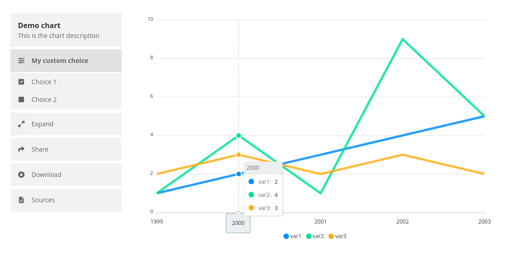

# Global Inequality Charts 

A divi module to display interactive charts on a wordpress site and provides the following tools:

- Expand: Opens a modal to display the chart (or an extended version) full-screen
- Share: Provides different options to share the chart
    - Twitter
    - Facebook
    - Copy link
- Download
    - Image: Generates an image of the chart
    - Data: Opens the chart's directory on GitHub
- Sources: Opens a popover with information about the chart's sources
- Custom chart-specific tools



## Installation

To install the latest version of the plugin:

- Select the latest workflow from [Actions](https://github.com/Global-Inequality-Project/global_inequality_charts/actions) and download the plugin file from `Artifacts`
- Install the plugin on your wordpress instance

## Usage

A chart is integrated into a wordpress page as follows:

- Open a page or a post with the divi editor
- Add a `global inequalities charts` module to the page
- Select one of the charts in the module settings

## Licensing

The plugin code is released under the MIT license. Each of the charts and the corresponding datasets can be subject to different authorships and license terms, which are indicated in the respective directory of each chart. 

## Overview

Each chart has a unique ID, denoted in this documentation as `[chartID]`. 

The chart files can be found in the root directory of the plugin at `/wp-content/plugins/global_inequality_charts/`.

The file structure of the plugin is as follows:

- plugin-root
    - `charts`
        - `[chartID]` -> one folder for each chart
    - `assets`
        - `js` -> here is where the magic happens
            - `templates` -> contains different layouts for the chart interface
    - `includes` -> the divi module
    - `languages` -> could be used for translations
    - `node_modules` -> external js libraries
    - `scripts` -> automatically generated js
    - `styles` -> automatically generated css

## Adding new charts

You can add a new chart to the plugin as follows:

- Create a new folder in `charts` with the name of the `[chartID]`
- In the folder, create the following files:
   - `[chartID].json` -> contains the chart settings
   - `[chartID].js` -> contains the chart render function
   - `[chartID]_sources.txt` -> Information on data sources
   - `[chartID].css` -> optional: contains custom css for the graph
   - `[chartID].png` -> optional: image that is used when the chart is shared (1200×630 px)
   - `README.md` -> optional: custom information regarding the chart and used data
   - `LICENSE` -> optional: custom license regarding the chart and used data

An example can be found in `charts/demo_chart/`.

### `[chartID].json` (Version 4)

This file contains the following chart settings:

- id: [chartID]
- title: the human readable name that shows in the divi editor
- description: a short description of the chart
- author: the author(s) of the chart
- template: the template of the chart -> `assets/js/templates/[template].js`
- schema_version: the version of the schema, this increases, when new features are added.
- libraries: libraries that should be loaded in order to show the graph

The following entries for libraries are currently supported. They are optional and can be omitted when not used. Entries marked with a * can be adapted in `assets/js/`.

- `apexcharts` (v3.33)
- `d3js` (v4.13)
- `chartutils` *

The following templates are currently supported:

- `main` (default)

Here is an example:

```
{
    "id": "demo_chart",
    "title": "Demo chart",
    "description": "This is the chart description",
    "author": "Name(s) of the author(s) <Email address>",
    "template":"main",
    "schema_version": 4,
    "libraries": {
        "apexcharts": true,
        "chartutils": true
    }
}

```

### `[chartID].js`

The script `[chartID].js` has to call the function `createChartInterface()`, which takes the following inputs:

- `chartID` (string): The unique ID of the chart
- `renderFunc` (function): Function to render the main chart (see below)
- `customTools` (string, optional): Will be forwarded to the chosen template to display custom tools

The function `renderFunc` takes two inputs:

- `canvasID` (string): id of the chart's location
- `modal` (bool): indicates whether the chart is to be rendered normally or in the expansion modal

The function is meant to render the chart within `canvasID`, using 100% of the the canvas's width and height. The function can return a chart object, which will be stored in `window.charts[chartID]`. If data for the chart should be stored globally, you can use `window.chart_data[chartID]`. When the chart is rendered onto the expansion modal, the object is stored in `window.charts['modal']`. When the modal is closed the chart object's `destroy()` function is called if it exists.


### `[chartID].css`

The file `[chartID].css` can be used to modify chart styles. Please use the selectors `#chart-[chartID]` or `chart-modal-content-[chartID]` to affect only chart styles. Here are some examples:

```
/* Custom graph height */

#chart-[chartID] .chart-box-outer {
  margin-top: -15px;  
  padding-top: calc(max(66%, 300px)); 
}

/* Make modal scrollable */

#chart-modal-content-[chartID] {
  overflow-y: auto; 
  overflow-x: hidden;
  width: 100%;
  height: 100%;
  padding-right: 20px;
}
```

## Additional development

### Building the plugin 

Whenever a new commit is made on this repository, [a GitHub action](https://github.com/Global-Inequality-Project/global_inequality_charts/actions) automatically builds the plugin, which can be found as an artifact of the latest workflow.

To build the plugin manually, take the following steps. This is not needed for adding a chart, but it is necessary to update the style and script files.

- Install nodejs version 14, version 16 is not supported. We recommend to use nvm for this.  [https://github.com/elegantthemes/create-divi-extension/issues/541].
- Install yarn with `npm install -g yarn`
- Install the dependencies with `yarn install`
- Build the module with `yarn build`

For development you can use `yarn start`. This will start a local server that serves the files and builds the module after saving a file. 

### Adding new libraries  

If a chart needs external javascript libraries, they can either be added to `assets/js` or to `package.json` and `.github/workflows/workflows.yaml`. Adding a library via `package.json` is the prefered way. To keep the plugin GDPR compliant, libraries should not be added via a CDN service. In order to load the library correctly it also has to be added to the `includes/modules/Charts/Charts.php -> load_libraries` file. You can also create a GitHub issue to request a new library to be added.

### Adding new templates

Each template has a unique id. The template file must be as follows: `assets/js/templates/[templateID].js`. The template has to be a javascript file that contains the template render function. See `assets/js/templates/main.js` for an example. The chart render function has to be called `createTemplate_[templateID]()`. It has to return a string that contains the html code of the template. The function takes the arguments `chartID, chartTitle, chartDescription, chartSources, customTools` which can be inserted into the html string. The html code is inserted into the divi module. To display correctly, it must contain the following element which will serve as the canvas for the chart:

```
<div id="chart-canvas-${chartID}"> </div>
```

### Adding custom tools

The feature to add custom tools can add additional tools to the template. Each template might have different uses for the input it gets through the argument `customTools`. The main template takes an html string that is added below the chart description. For example, the following string could be passed to `customTools` to add an additional button:

```
<button class="chart-btn" onclick="myCustomFunction()">
  <i class="fa-solid fa-sliders"></i>My custom tools
</button>
```

The function `myCustomFunction()` would then have to be defined in `[chartID].js`. A more advanced example can be found in `charts/demo_chart/demo_chart.js`.

